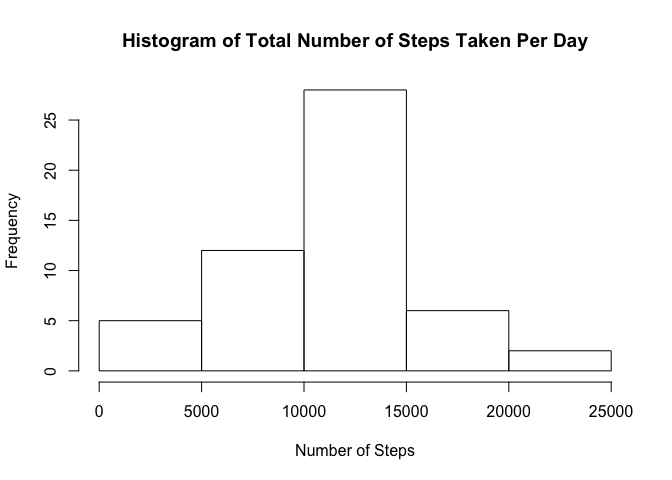
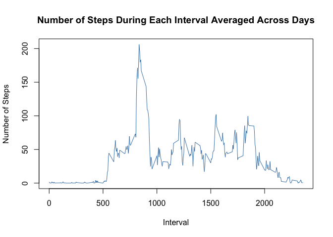
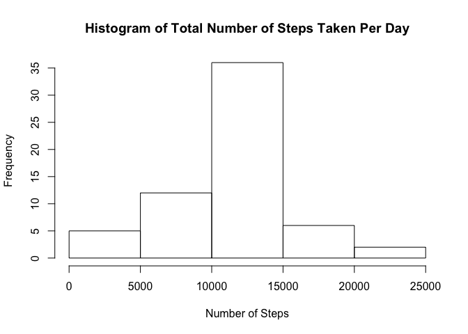
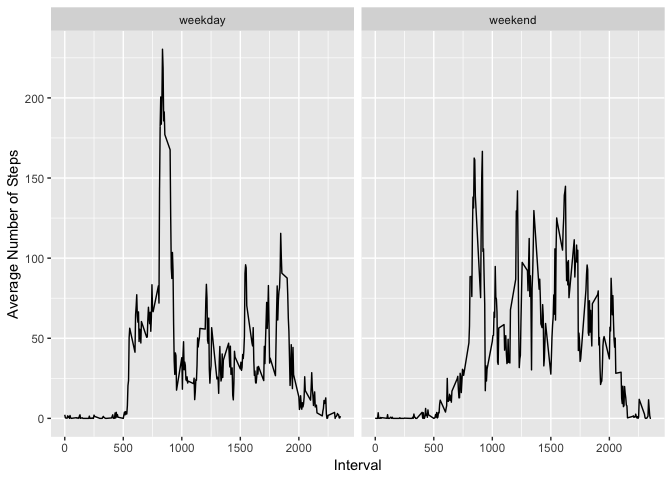

## Loading and Preprocessing the Data

```r
stepsOriginal = read.csv("data/activity.csv", stringsAsFactors = FALSE)
steps = na.omit(stepsOriginal)
```

## Mean Total Number of Steps Taken per Day


```r
totalStepsPerDay = tapply(steps$steps, steps$date, sum)
hist(totalStepsPerDay, xlab = "Number of Steps",
     main = "Histogram of Total Number of Steps Taken Per Day")
```

<!-- -->


```r
round(mean(totalStepsPerDay))
```

```
## [1] 10766
```

```r
round(median(totalStepsPerDay))
```

```
## [1] 10765
```

## Average Daily Activity Pattern


```r
stepsPerInterval = data.frame(interval = unique(steps$interval),
                              steps = tapply(steps$steps, steps$interval, mean))
with(stepsPerInterval, plot(interval, steps, type = "l", col = "steelblue",
     xlab = "Interval", ylab = "Number of Steps", main = "Number of Steps During Each Interval Averaged Across Days"))
```

<!-- -->

What is the maximum average number of steps in one interval and which interval contains the most steps?


```r
max(stepsPerInterval$steps)
```

```
## [1] 206.1698
```

```r
stepsPerInterval$interval[which.max(stepsPerInterval$steps)]
```

```
## [1] 835
```

## Missing Values

Up to now I just ignored the missing values by using `na.omit()`. Now I will have a closer look at them. First, how many `NA`s are there?


```r
sum(is.na(stepsOriginal$step))
```

```
## [1] 2304
```

To impute these `NA`s I will use the average number of steps for each interval (calculated above).


```r
stepsNaImputed = stepsOriginal
for (i in 1:nrow(stepsNaImputed)) {
  if (is.na(stepsNaImputed$steps[i])) {
    stepsNaImputed$steps[i] = stepsPerInterval$steps[stepsPerInterval$interval == stepsOriginal$interval[i]]
  }
}

stepsPerDay = tapply(stepsNaImputed$steps, stepsNaImputed$date, sum)
hist(stepsPerDay, xlab = "Number of Steps",
     main = "Histogram of Total Number of Steps Taken Per Day")
```

<!-- -->

Does imputing change the mean and median number of steps taken per day?


```r
round(mean(stepsPerDay))
```

```
## [1] 10766
```

```r
round(median(stepsPerDay))
```

```
## [1] 10766
```
The mean stayed the same and the median increased by one step compared to above.


## Differences in Activity Patterns Between Weekdays and Weekends


```r
stepsNaImputed$weekday = weekdays(as.Date(stepsNaImputed$date))
stepsNaImputed$weekday = ifelse(stepsNaImputed$weekday %in% c("Saturday", "Sunday"),
                                "weekend", "weekday")

stepsNaImputed %>%
  group_by(weekday, interval) %>%
  summarise(meanStepsTaken = mean(steps)) %>%
  ggplot(aes(interval, meanStepsTaken)) +
  geom_line() +
  facet_wrap(~ weekday) +
  xlab("Interval") +
  ylab("Average Number of Steps")
```

<!-- -->

